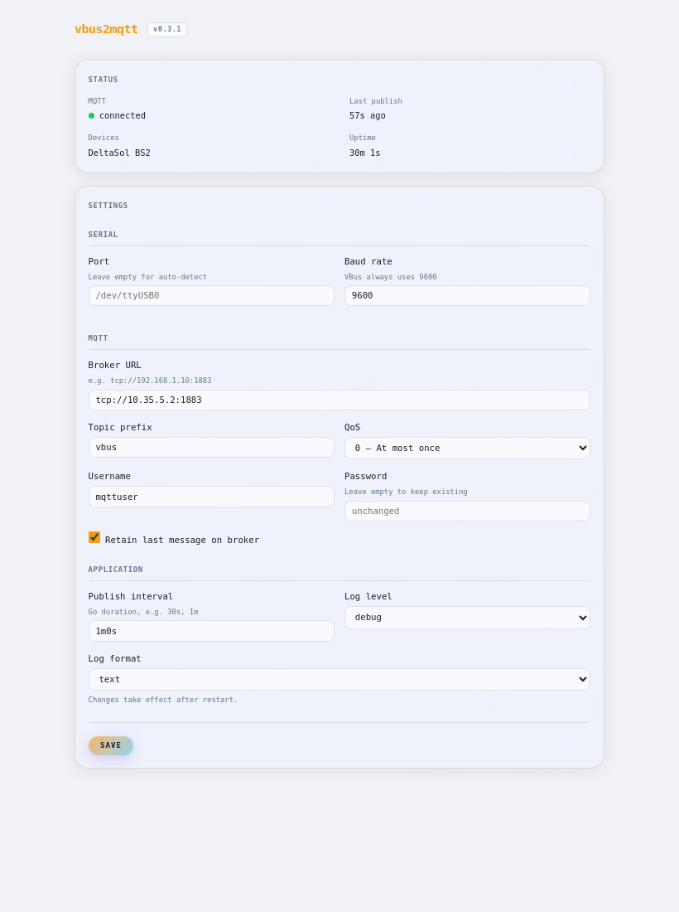

# vbus2mqtt

RESOL VBus (USB serial adapter) → MQTT bridge with web UI.

Reads the VBus data stream from a solar controller, publishes JSON telemetry to MQTT,
and exposes a settings web UI at `:8080` for runtime configuration without restarts.

Written in Go. Runs as a rootless Podman/Docker container. Multi-arch (amd64 · arm64 · armv7).



---

## Web UI

Open `http://<host>:8080` after startup.

- Live status: MQTT connection, last publish, detected devices, uptime
- Edit all settings at runtime — changes take effect immediately
- Settings are persisted to `/data/config.json` and survive container restarts
- MQTT broker / credentials / serial port changes trigger an automatic reconnect
- Log level changes take effect within one second (no reconnect needed)
- Optional HTTP Basic Auth via `WEB_USER` / `WEB_PASS` env vars

---

## MQTT output

Topic: `<MQTT_TOPIC_PREFIX>/<SOURCE_ADDR_HEX>`

Example for a DeltaSol BS2 (source address `0x4278`):

```
Topic:   vbus/4278
Payload: {
  "device":    "DeltaSol BS2",
  "source":    "0x4278",
  "timestamp": 1713180000,
  "fields": {
    "temp_sensor1":      67.3,
    "temp_sensor2":      22.1,
    "pump_speed_1":      100,
    "operating_hours_1": 1234,
    "error_mask":        0
  },
  "units": {
    "temp_sensor1":      "°C",
    "temp_sensor2":      "°C",
    "pump_speed_1":      "%",
    "operating_hours_1": "h"
  }
}
```

## Supported controllers

The device registry is generated from the [Resol VBus Specification](https://github.com/danielwippermann/resol-vbus)
and covers **360+ Resol/RESOL/Solarfocus devices** (any broadcast packet with dst=0x0010, cmd=0x0100).

Custom overrides in `internal/vbus/registry_custom.go` take precedence over the generated entries —
used for devices where the spec disagrees with the actual hardware payload layout.

**Currently custom-defined:**

| Device              | Source   | Note                                          |
|---------------------|----------|-----------------------------------------------|
| DeltaSol BS2        | `0x4278` | Cosmo Multi DrainBack variant, live-captured  |

> **Known limitation (DeltaSol BS2):** `operating_hours_1` and `operating_hours_2` always read 0.
> The offset in `registry_custom.go` likely doesn't match this hardware variant.
> All other fields are validated and correct.

To regenerate the registry after updating the VSF:

```bash
go generate ./internal/vbus/...
```

Unknown devices are logged at DEBUG level with their raw payload hex.
Add new custom devices in `internal/vbus/registry_custom.go`.

---

## Quickstart

```bash
podman run -d \
  --device /dev/serial/by-id/usb-<your-adapter>:/dev/ttyUSB0 \
  --group-add keep-groups \
  -e MQTT_BROKER=tcp://192.168.1.10:1883 \
  -e MQTT_USER=mqttuser \
  -e MQTT_PASS=secret \
  -v vbus2mqtt_data:/data \
  --name vbus2mqtt \
  ghcr.io/zk35-de/vbus2mqtt:latest
```

Or with compose:

```bash
cp .env.example .env
$EDITOR .env        # set MQTT_BROKER at minimum
podman compose up -d
```

Open `http://localhost:8080` for the settings UI.

## Build

### Local (requires Go 1.23+)

```bash
go build -ldflags "-X main.version=$(git describe --tags --always)" \
  -o vbus2mqtt ./cmd/vbus2mqtt
```

### Container single-arch

```bash
podman build --build-arg VERSION=$(git describe --tags --always) -t vbus2mqtt .
```

### Multi-arch (CI uses podman buildx)

```bash
podman build --platform linux/amd64,linux/arm64,linux/arm/v7 \
  --build-arg VERSION=$(git describe --tags --always) \
  -t registry.example.com/vbus2mqtt:latest \
  --manifest vbus2mqtt-multi .
podman manifest push vbus2mqtt-multi registry.example.com/vbus2mqtt:latest
```

---

## Configuration

All settings can be changed at runtime via the web UI at `:8080`.
Environment variables set the initial defaults.

| Variable           | Default                  | Description                              |
|--------------------|--------------------------|------------------------------------------|
| `SERIAL_PORT`      | *(auto-detect)*          | e.g. `/dev/ttyUSB0`                      |
| `SERIAL_BAUD`      | `9600`                   | VBus baud rate (always 9600)             |
| `MQTT_BROKER`      | `tcp://localhost:1883`   | MQTT broker URL                          |
| `MQTT_TOPIC_PREFIX`| `vbus`                   | Topic prefix                             |
| `MQTT_USER`        |                          | MQTT username (optional)                 |
| `MQTT_PASS`        |                          | MQTT password (optional)                 |
| `MQTT_QOS`         | `0`                      | MQTT QoS level (0/1/2)                   |
| `MQTT_RETAIN`      | `true`                   | Retain last message on broker            |
| `MQTT_HA_DISCOVERY`| `false`                  | Enable Home Assistant MQTT Autodiscovery |
| `MQTT_HA_DISCOVERY_PREFIX` | `homeassistant` | Discovery topic prefix               |
| `PUBLISH_INTERVAL` | `30s`                    | How often to push telemetry              |
| `LOG_LEVEL`        | `info`                   | `debug` \| `info` \| `warn` \| `error`  |
| `LOG_FORMAT`       | `json`                   | `json` \| `text`                         |
| `WEB_ADDR`         | `:8080`                  | HTTP listen address for the web UI       |
| `WEB_USER`         |                          | HTTP Basic Auth username (optional)      |
| `WEB_PASS`         |                          | HTTP Basic Auth password (optional)      |
| `CONFIG_FILE`      | `/data/config.json`      | Persistence path for web UI changes      |

Both `WEB_USER` and `WEB_PASS` must be set to enable Basic Auth.
The `/health` endpoint is always public regardless of auth config.

### Config persistence

Settings saved via the web UI are written atomically to `CONFIG_FILE`.
Mount `/data` as a volume so changes survive container restarts:

```yaml
volumes:
  - vbus2mqtt_data:/data
```

The file-based config takes precedence over environment variables.
To reset to env-var defaults, delete the file and restart.

---

## Production deployment (auto-start after reboot)

`restart: unless-stopped` alone is not enough — after a reboot nobody calls `podman compose up`.
The reliable solution is a systemd user service combined with `loginctl enable-linger`.

```bash
# 1. Allow the user slice to survive without an active SSH session (run once as root)
sudo loginctl enable-linger <your-user>

# 2. Create the systemd user service
mkdir -p ~/.config/systemd/user

cat > ~/.config/systemd/user/vbus2mqtt.service << 'EOF'
[Unit]
Description=vbus2mqtt
After=network-online.target

[Service]
Type=oneshot
RemainAfterExit=yes
WorkingDirectory=/opt/stack/vbus2mqtt
ExecStart=/usr/bin/podman compose up -d
ExecStop=/usr/bin/podman compose down

[Install]
WantedBy=default.target
EOF

# 3. Enable and start
systemctl --user daemon-reload
systemctl --user enable --now vbus2mqtt
```

After this the container survives SSH logout and starts automatically after every reboot.

```bash
# Useful commands
systemctl --user status vbus2mqtt
journalctl --user -u vbus2mqtt -f
```

---

## Home Assistant Autodiscovery

Set `MQTT_HA_DISCOVERY=true` to enable [MQTT Autodiscovery](https://www.home-assistant.io/integrations/mqtt/#mqtt-discovery).
vbus2mqtt will publish a discovery config for each sensor field the first time it sends telemetry,
and again after every reconnect so HA always has up-to-date metadata.

Discovery topics follow the HA convention:

```
homeassistant/sensor/vbus2mqtt_<src>_<field>/config
```

Each sensor in HA gets the correct `device_class` and `state_class` derived from its unit:

| Unit      | device_class        | state_class        |
|-----------|---------------------|--------------------|
| `°C`, `K` | `temperature`       | `measurement`      |
| `W`, `kW` | `power`             | `measurement`      |
| `Wh`, `kWh` | `energy`          | `total_increasing` |
| `V`       | `voltage`           | `measurement`      |
| `bar`     | `pressure`          | `measurement`      |
| `l/h`     | `volume_flow_rate`  | `measurement`      |
| other     | *(none)*            | `measurement`      |

All sensors for one VBus device are grouped under a single HA device entry
(e.g. "DeltaSol BS2") identified by `vbus2mqtt_<src_hex>`.

The existing telemetry topic structure (`vbus/<src_hex>`) is unchanged —
autodiscovery is purely additive.

---

## HTTP API

| Method | Path         | Description                          |
|--------|--------------|--------------------------------------|
| `GET`  | `/`          | Settings web UI                      |
| `GET`  | `/health`    | `{"status":"ok","version":"..."}` (always public) |
| `GET`  | `/api/config`| Current config (password redacted)   |
| `PUT`  | `/api/config`| Update config (JSON body)            |
| `GET`  | `/api/status`| Runtime status (MQTT, devices, etc.) |

---

## USB / serial access on Linux

```bash
# Check device node:
ls -la /dev/ttyUSB* /dev/ttyACM*
# Prefer the stable symlink:
ls /dev/serial/by-id/

# Rootless Podman — pass the device and group:
podman run --device /dev/serial/by-id/usb-...-if00:/dev/ttyUSB0 \
           --group-add keep-groups ...
```

### Rootless Podman: Permission denied on serial device

Without `privileged: true`, the container user has no access to the serial device by default.
Fix: add the host user to `dialout` and use `group_add: keep-groups` in compose.

```bash
# Add host user to dialout group (once), then re-login
sudo usermod -aG dialout <your-user>
```

In `compose.yml` — **no** `privileged: true`, instead:

```yaml
devices:
  - /dev/serial/by-id/usb-<your-id>:/dev/ttyUSB0
group_add:
  - keep-groups   # passes host supplementary groups (incl. dialout) into the container
```

`keep-groups` is Podman-specific. It is the correct replacement for `privileged: true`
when the only requirement is serial device access.

Add a udev rule for a stable device path:

```
# /etc/udev/rules.d/99-vbus.rules
SUBSYSTEM=="tty", ATTRS{idVendor}=="10c4", ATTRS{idProduct}=="ea60", SYMLINK+="ttyVBUS"
```

Then use `--device /dev/ttyVBUS:/dev/ttyUSB0` or set `SERIAL_PORT=/dev/ttyVBUS`.

---

## Troubleshooting

**Device not detected**
```bash
podman logs vbus2mqtt | grep serial
# → set SERIAL_PORT explicitly via web UI or env var
```

**Unknown device / no telemetry**
```bash
# Enable debug logging via web UI, then:
podman logs vbus2mqtt | grep "unknown vbus device"
# → note the src= address and add it to internal/vbus/registry_custom.go
```

**Permission denied on /dev/ttyUSB0**
```bash
sudo chmod a+rw /dev/ttyUSB0    # temporary
# or: pass --group-add keep-groups with rootless Podman
```

**Wrong temperatures (e.g. 6553.5°C)**
The source address matched a different device in the registry.
Run with `LOG_LEVEL=debug` and check the actual `src=` address in log output,
then verify the field offsets in `registry_custom.go`.

---

## Credits

Device registry generated from the
[RESOL VBus Specification](https://github.com/danielwippermann/resol-vbus/tree/master/src/specification)
by [Daniel Wippermann](https://github.com/danielwippermann), licensed under MIT.

The `tools/vbus_specification.vsf` binary is sourced from that project.
